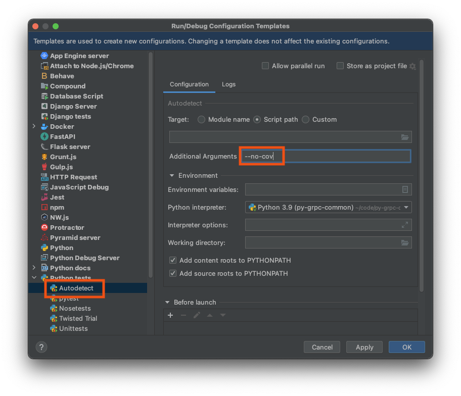

# Development 

Below how to bootstrap your python environment, so it is sandboxed.

## Development Environment Using Pyenv and Virtualenv

Install:

* (optional) [pyenv](https://github.com/pyenv/pyenv);
* [virtualenv](https://virtualenv.pypa.io/en/latest/).

### macOS

You need `Xcode`:

```bash
xcode-select --install
```

### (Optional) Pyenv

For macOS follow [https://gist.github.com/eliangcs/43a51f5c95dd9b848ddc](https://gist.github.com/eliangcs/43a51f5c95dd9b848ddc).
You might also need [https://github.com/jiansoung/issues-list/issues/13#issuecomment-478575934](https://github.com/jiansoung/issues-list/issues/13#issuecomment-478575934).

Set python 3.9 as default:

```basn
pyenv install 3.9.10
```

Set pyenv defaults:
```bash
pyenv global 3.9.10
pyenv local 3.9.10
```

### Virtualenv

Install Virtualenv and update `pip`:

```bash
pip3 install -U pip virtualenv
```

Create virtualenv:

```bash
virtualenv -p python3 -q .venv
```

To activate your python virtualenv:

```bash
. .venv/bin/activate
```

Validate with:

```bash
python --version
python3 --version
```

Expected:

```text
Python 3.9.10
Python 3.9.10
```

Install packages:

```bash
pip install -U pip wheel setuptools
```

## Install all dependencies

Install packages:

```bash
pip install ".[all]"
```

## Auto-formatting with black

In this project black was chosen for the auto-formatter.

[](https://github.com/python/black)

### Install black with vim

After following the instructions I have in my ``~/.vimrc`` the following:

```vimrc
" black formatter
let g:black_linelength=100
let g:black_skip_string_normalization=1
autocmd BufWritePre *.py execute ':Black'
```

# Deployment

## Install

Will add the library to your local python environment (if you are using virtualenv, it will be added to it only).

```bash
python3 ./setup.py install
```

## Generate Wheel file

For advanced usage of Wheel files see, for instance, [Python on Wheels](https://lucumr.pocoo.org/2014/1/27/python-on-wheels/).

```bash
python3 ./setup.py bdist_wheel
```

Check the files:

```bash
ls dist
```

Expected:

```text
py_grpc_common-1.0-py2.py3-none-any.whl
```

## PyCharm Users

You need to add ``--no-cov`` to your `Run/Debug` settings.
Below are the instructions on how to do it.
Tested with `PyCharm 2021.3.2 (Professional Edition)` for macOS.

### Menu `Run` click on `Edit Configurations...`:


### Click `Edit configuration templates...`


### Select `Python tests/Autodetect`

Add `--no-cov` to `Additional Arguments` field:



### Select `Python tests/pytest`

Add `--no-cov` to `Additional Arguments` field:

